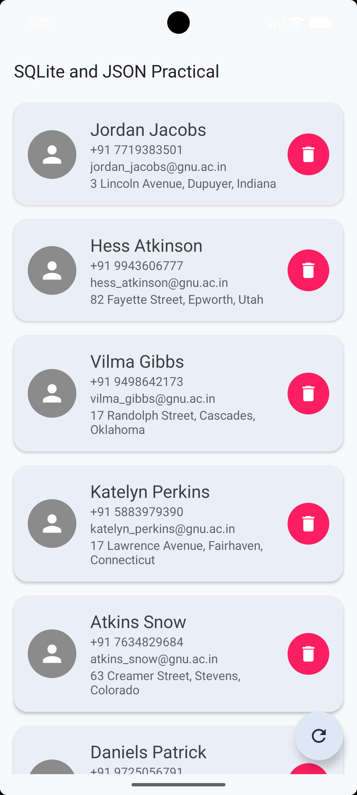
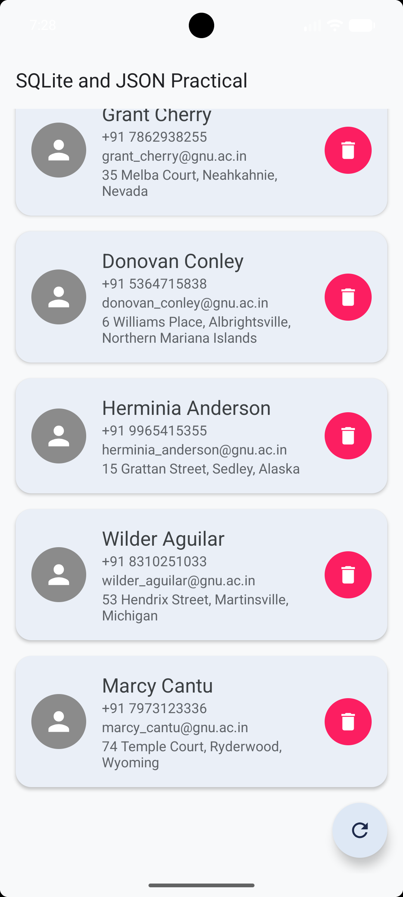

# Practical 7
 
**Enrollment Number:** 24012011115

 
## Aim
Develop an Android application that retrieves person data in JSON format from an internet API and stores the retrieved data in an SQLite database.
 
## Description
This practical builds an Android application (written in Kotlin) that connects to the internet, downloads a list of people in JSON format, saves that list into a local SQLite database, and shows it on screen as a scrollable list of cards.
 
The app works in a simple cycle. When it starts, it loads whatever is already stored in the SQLite database and shows it, so previously downloaded data is available even without internet. If the database is empty (first launch), or when the user taps the round **refresh** button, the app sends an HTTP GET request to the API using `HttpURLConnection`. This request runs on a background thread using `CoroutineScope(Dispatchers.IO)`, because Android does not allow network calls on the main (UI) thread. The JSON text that comes back is parsed into `Person` objects. Each `Person` is stored in the SQLite table through `SQLiteOpenHelper`, and the list on screen is refreshed from the database using `withContext(Dispatchers.Main)`.
 
Each person is shown in a `RecyclerView` card with an icon, name, phone number, email and address. A **trash icon** on each card deletes that person from the database and from the screen. Tapping a card opens a second screen (`MapActivity`), where the whole `Person` object is passed through an `Intent`. This works because the `Person` class implements `Serializable`. The second screen shows the person's name, address and latitude/longitude and has a button that opens the location in a maps app.
 
In short: **Internet (JSON) -> parse into Person objects -> save in SQLite -> display in RecyclerView -> delete or open details.**
 
## How the Application Works (Step by Step)
1. **App starts:** `MainActivity` creates the `DBHelper` and reads all saved people from SQLite.
2. **Show saved data:** the saved list is given to `PersonAdapter`, which displays it in the `RecyclerView`.
3. **Fetch from the internet:** if the database is empty, or the refresh button is pressed, `HttpRequest.get()` downloads the JSON on a background thread.
4. **Parse JSON:** the JSON array is read with `JSONArray` / `JSONObject`, and each entry becomes a `Person` object.
5. **Store in SQLite:** all `Person` objects are inserted inside one database transaction. `CONFLICT_REPLACE` is used, so refreshing again never creates duplicate rows.
6. **Update the UI:** the list is read back from the database and the adapter is refreshed on the main thread.
7. **Delete:** pressing the trash icon removes that row from the table and the list is reloaded.
8. **Open details:** tapping a card sends the `Person` (Serializable) to `MapActivity`, which shows the location details and can open a maps app.
## Project Structure
| File | Purpose |
|---|---|
| `Person.kt` | Data class holding id, first name, last name, phone, email, address, latitude and longitude. Implements `Serializable`. |
| `HttpRequest.kt` | Makes the HTTP GET request with `HttpURLConnection` and returns the response text. |
| `DBHelper.kt` | `SQLiteOpenHelper` that creates the `persons` table and provides save, get-all and delete functions. |
| `PersonAdapter.kt` | `RecyclerView` adapter that binds each `Person` to a card and handles delete and card-tap events. |
| `MainActivity.kt` | Main screen: loads saved data, fetches new data, parses JSON, saves to the database and updates the list. |
| `MapActivity.kt` | Receives the `Person` through the `Intent` and shows the location with an "Open in Maps" button. |
| `activity_main.xml` | Main screen layout with title, progress bar, `RecyclerView` and refresh floating button. |
| `item_person.xml` | Card layout for one person (icon, name, phone, email, address, delete button). |
| `activity_map.xml` | Layout of the details/location screen. |
| `AndroidManifest.xml` | Declares the activities and the `INTERNET` permission. |
 
## JSON Data Format
The API returns an array of person objects similar to this:
 
```json
[
  {
    "id": 1,
    "name": { "first": "Jordan", "last": "Jacobs" },
    "phone": "+91 7719383501",
    "email": "jordan_jacobs@gnu.ac.in",
    "address": "3 Lincoln Avenue, Dupuyer, Indiana",
    "latitude": "23.0225",
    "longitude": "72.5714"
  }
]
```
 
## Database Design
Database name: `persons.db`, table: `persons`
 
| Column | Type | Description |
|---|---|---|
| `id` | INTEGER (Primary Key) | Unique id of the person |
| `first_name` | TEXT | First name |
| `last_name` | TEXT | Last name |
| `phone` | TEXT | Phone number |
| `email` | TEXT | Email address |
| `address` | TEXT | Full address |
| `latitude` | REAL | Latitude of the address |
| `longitude` | REAL | Longitude of the address |
 
## Key Concepts and Technologies
*   **JSON Parsing:** Reading structured data from a web API using `JSONArray` and `JSONObject` and converting it into Kotlin objects.
*   **Networking:** Making HTTP GET requests with `HttpURLConnection`, including headers, timeouts and error handling.
*   **Coroutines:** Running network and database work on `Dispatchers.IO` so the UI never freezes, then switching to `Dispatchers.Main` to update the screen.
*   **RecyclerView:** Efficiently displaying a long list by reusing card views through a custom adapter (`PersonAdapter`).
*   **SQLite Database:** Storing data locally with `SQLiteOpenHelper` (create table, insert/replace, read all, delete) for offline access.
*   **Serialization:** Passing a complete `Person` object between activities using `Intent` extras and `Serializable`.
*   **Material Design:** `MaterialCardView` cards and a `FloatingActionButton` for the refresh action.
*   **Permissions:** Declaring `android.permission.INTERNET` in the manifest so the app is allowed to use the network.
## Requirements
*   Android Studio with a Kotlin project
*   Minimum internet connection on the emulator/device
*   Dependencies: `appcompat`, `recyclerview`, `material`, `lifecycle-runtime-ktx`, `kotlinx-coroutines-android`
*   App theme must be a Material theme (`Theme.Material3.Light.NoActionBar`), otherwise `MaterialCardView` will crash.
## How to Run
1. Open the project in Android Studio and let Gradle sync.
2. Put the Kotlin files in `app/src/main/java/<your package>/`, the layouts in `res/layout/` and the icons in `res/drawable/`.
3. Make sure the `INTERNET` permission is added in `AndroidManifest.xml` (outside the `<application>` tag).
4. Run the app on an emulator or a real device with internet.
5. The list loads automatically on first launch. Tap the round refresh button to download again, the trash icon to delete a person, and a card to open its location.
## Common Errors and Fixes
| Problem | Reason and Fix |
|---|---|
| `NetworkOnMainThreadException` | Network call was made on the main thread. Keep it inside `CoroutineScope(Dispatchers.IO)`. |
| `SecurityException` / nothing loads | `INTERNET` permission is missing or placed inside `<application>`. |
| HTTP 401 / 403 | The API token is missing or expired. Send `Authorization: Bearer <token>` or generate a new link. |
| Crash about `Theme.MaterialComponents` | App theme is not a Material theme. Use `Theme.Material3.Light.NoActionBar`. |
| `Unresolved reference: R` | Package name does not match the project namespace, or Gradle is not synced. |
| `JSONException` | Response is not the expected JSON array. Print the raw response to check it. |
 
## Screenshots
 
<div align="center">
  <!-- Replace 'screenshot1.png' and 'screenshot2.png' with your actual screenshot file names and place them in the root directory alongside this README or update the path to the images -->
  
  &nbsp;&nbsp;&nbsp;&nbsp;&nbsp;
  
</div>
## Conclusion
This practical demonstrates a complete data flow in an Android app: downloading JSON from a web API, converting it into objects, storing it permanently in SQLite, showing it in a `RecyclerView`, and passing objects between screens. It also shows why background threads (coroutines) are needed for network work and how a local database lets the app show data without an internet connection.
 
